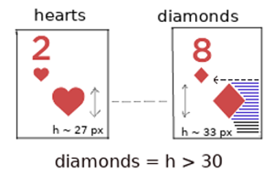
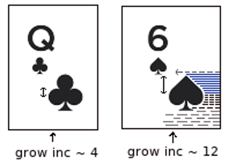
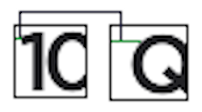

#### Step 1: Load image as a Buffer. (x, y - pixels)
Simple way with a **BufferedImage**
#### Step 2 - Cut 10 % of picture with cards content. (They are located in the center of the picture)
How to: 
```java
subImage = image.getSubimage(0, 550, image.getWidth(), 160);
```
where 550 - y coordinate, located higher than card content. 160 - cards content height.
#### Step 3 - Check cards count. 
Logic: We iterate for x - coordinate on cards content, and trying to find entry 
WHITE(gray) color points. If we find such an entry, we are sure that there is a card in front of us.

Now we move the x coordinate to the width of this entry and add the map width to it. Then we repeat this procedure.
Example:
```java
    
        int count = 0;
        int whiteColors = 0;

        for (int y = 0; y < raster.getHeight(); y++) {
            for (int x = 0; x < raster.getWidth(); x++) {
                int RGBA = subImage.getRGB(x, y);

                int red = (RGBA >> 16) & 255;
                int green = (RGBA >> 8) & 255;
                int blue = RGBA & 255;

                if (red == WHITE_COLOR && green == WHITE_COLOR && blue == WHITE_COLOR
                    whiteColors++;
                    if (whiteColors == WHITE_COLOR_ENTRY) { // (entry = 30)
                        x = x + CARD_WIDTH - WHITE_COLOR_ENTRY; (card width = 64)
                        count++;
                    }
            }
        }
```

#### Step 4 - Check suit color
Okey, now we got cards count, those range and coordinates. <br>
We know that there are only 4 suits - and 2 of them (Hearts and Diamonds) are *red*. <br>
Solution for check a red suits is simple:
```java
    private void checkSuit() {
        for (Map.Entry<Integer, Point> entry : DeckAnalyzer.cards.entrySet()) {
            Point point = entry.getValue();
            BufferedImage clipped = subImage.getSubimage(point.x, point.y, CARD_WIDTH, CARD_HEIGHT);

            int reds = 0;

            label:
            for (int x = 0; x < width; x++) {
                for (int y = 0; y < height; y++) {
                    int RGBA = clipped.getRGB(x, y);
                    if (red > 60 && red > green * 2 && red > blue * 2)
                        reds++;
                    if (reds > 20)
                        break label;
                }
            }
        }
        if (reds > 0) 
            System.out.println(entry.getKey() + " is red!");
    }
```
where Point(x, y) - a card coordinates on subImage.

#### Step 5 - Find the difference between hearts and diamonds.

The best explanation is visualization:<br>


We know that diamonds is ***higher*** than hearts.<br>
We start off from the bottom right point and simply measure the height of the shape's entry.

#### Step 6 - Find the difference between spades and clubs.

Example:<br>


Again we starting from the bottom right point and looking for entries on the diagonal.<br>
But now, unlike the previous algorithm, we only count the grow increment.

#### Step 7 - Find the Ten and Queen.

Okay, now we got all suites, let's start looking for a deck. <br>
Before I start explaining the map search approach, I have to show this shit: <br>


The card cut algorithm  looks awkward.<br>
It can be seen that for the __Queen__ and __Ten__, the value of the card goes beyond the bounds.<br>


For the solution, we take any initial byte of the entry. If it is less, then it is __Ten__, if it is more then a __Queen__.
